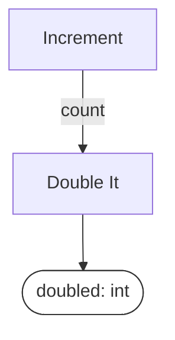
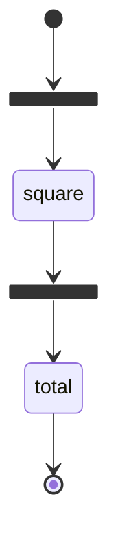

# workflow-plan

**Describes the shape of a workflow, deliberately leaving out execution** — retries, durability,
fan-in/out, concurrency. The intent is to let you experiment with the algorithm separately from
debugging the execution.

The Python package is `workflow_plan`.

## Start with something you already have

This is [Pydantic Graph's `simple_counter.py`](https://pydantic.dev/docs/ai/graph/builder/),
verbatim:

```python
g = GraphBuilder(state_type=CounterState, output_type=int)

@g.step
async def increment(ctx: StepContext[CounterState, None, None]) -> int:
    ctx.state.value += 1
    return ctx.state.value

@g.step
async def double_it(ctx: StepContext[CounterState, None, int]) -> int:
    return ctx.inputs * 2

g.add(
    g.edge_from(g.start_node).to(increment),
    g.edge_from(increment).to(double_it),
    g.edge_from(double_it).to(g.end_node),
)
```

Here is the same workflow as a Plan. Nothing is implemented:

```python
count   = Variable("count", int)
doubled = Variable("doubled", int)

class Increment(PlanStep):
    inputs, outputs = (), (count,)

class DoubleIt(PlanStep):
    inputs, outputs = (count,), (doubled,)

plan = Plan(name="counter", steps=(Increment(), DoubleIt()))
```

Two differences, and only the second is the point.

**Their `increment` writes `ctx.state.value` and declares its input type as `None`.** The dependency
between the two steps is real and does not appear in the graph. Here it is an edge, because
`Increment` produces `count` and `DoubleIt` consumes it — that is what makes them adjacent, and no
one wrote the edge down twice:



**And the Plan has no bodies.** It type-checks, renders and validates before any function exists.
That is the trade: you give up being able to run it, and you get to argue about the shape without a
runtime in the room.

Source: [`examples/pydantic_graph_docs/stage1_counter.py`](examples/pydantic_graph_docs/stage1_counter.py).

## Using it with Pydantic Graph

**You write the graph.** Keep their `GraphBuilder`, keep their edges, keep every runtime feature —
and let each node body call the implementation the Plan has bound:

```python
@g.step
async def increment(ctx: StepContext[None, None, None]) -> int:
    return strategy[Increment]()                    # the Plan's binding, not a body

@g.step
async def double_it(ctx: StepContext[None, None, int]) -> int:
    return strategy[DoubleIt](count=ctx.inputs)     # the keyword IS the Variable name
```

Six lines of glue and no compiler. What the Plan is still doing while you hold the pen:

| | |
|---|---|
| the declaration | `Increment` produces `count`, `DoubleIt` consumes it — checkable with no bodies |
| the binding | `strategy[DoubleIt]` — one Step, several peer implementations, chosen per run |
| the diagram | derived from the same declaration your nodes call |

The test that matters is not that both return `2`. It is that rebinding one entry in the `Strategy`
moves both sides, because there is one function and two call sites — see
`test_the_hand_written_wrapper_and_the_plan_run_the_same_function`.

Source: [`examples/pydantic_graph_docs/hand_written_wrapper.py`](examples/pydantic_graph_docs/hand_written_wrapper.py).

### There is also a compiler, and it is not the headline

`to_pydantic_graph(plan, strategy)` generates the whole graph, including their `.map()` and
`join(reduce_list_append)` for a fan-out:

```python
graph = to_pydantic_graph(plan, strategy)
result = await graph.run(state={}, inputs={"document": doc})
```

It exists because it proves the declaration is complete enough to compile, and
`tests/test_pydantic_graph.py` asserts both runtimes return the same result. But generating
somebody's graph invites *"why would I let you generate my graph?"*, which has no good answer. The
hand-written wrapper above is the integration to reach for.

## Installation

Not on PyPI. From source:

```bash
git clone https://github.com/borisdev/workflow-plan && cd workflow-plan
uv sync                          # add --extra pydantic-graph for the Pydantic Graph adapter
uv run pytest -q
```

## Concepts

| Type | What it is |
|---|---|
| `Variable[T]` | a named, typed value that flows between steps |
| `PlanStep` | one operation: which Variables it consumes, which it produces |
| `Plan` | a set of Steps; the edges are worked out from the Variables they share |
| `PlanDependency` | something a step needs to be reachable — an API, a database, a file on disk |
| `MultiStep` | a Plan that is also a step, so plans can nest |
| `Strategy` | a plain dict saying which function implements which step |
| `StepRunner` | the protocol for executing one step |
| `SequentialRunner` | runs the steps one at a time, in this process |
| `run(plan, inputs, runner)` | works out the order from the edges and runs it |

`Plan`, `PlanStep` and `Variable` are taken from [P-Plan](http://purl.org/net/p-plan#); `Activity`,
`Entity` and `Agent` from [PROV-O](https://www.w3.org/TR/prov-o/).

## A larger plan

```python
from workflow_plan import Plan, PlanStep, Variable, render_mermaid, check
from workflow_plan.invariants import topology, typing

document = Variable("document", Document)
outline  = Variable("outline", Outline)
summary  = Variable("summary", Summary)

class MakeOutline(PlanStep):
    inputs, outputs = (document,), (outline,)

class Summarize(PlanStep):
    inputs, outputs = (document, outline), (summary,)   # two inputs

plan = Plan(
    name="summarize_document",
    steps=(MakeOutline(), Summarize()),
    declared_inputs=(document,),
)

check(plan, [*topology.ALL, *typing.ALL])   # -> []
print(plan.shape())                         # -> ((Document,), (Summary,))
print(render_mermaid(plan))
```


No part of this workflow is implemented. Edges are computed from the Variables the Steps share, so
the diagram cannot disagree with the declaration.

Source: [`examples/hello/flow.py`](examples/hello/flow.py).

## Binding implementations

Implementations are ordinary functions, associated with Steps by a `Strategy` — a plain dict.
Parameter names must match the input Variable names, because the runner calls by keyword.

```python
from workflow_plan.execution import SequentialRunner, check_strategy, run

def summarize_fast(document: Document, outline: Outline) -> Summary: ...
def summarize_precise(document: Document, outline: Outline) -> Summary: ...

fast    = {MakeOutline: outline_by_sentence, Summarize: summarize_fast}
precise = {MakeOutline: outline_by_sentence, Summarize: summarize_precise}

check_strategy(plan, fast)          # -> () ; reports unbound Steps and signature mismatches
run(plan, {"document": doc}, SequentialRunner(fast))
run(plan, {"document": doc}, SequentialRunner(precise))
```

The same `plan` object serves both. One step may have several implementations without becoming
several steps.

`render_mermaid(plan, strategy)` labels each node with its bound implementation.

`SequentialRunner` is sequential and in-process: no concurrency, no retries, no durability. An
exception propagates.

## Fan-out

A step that runs per item declares the list it maps over. `map_over` names the source and collected
Variables; `inputs`/`outputs` describe one item.

```python
class Square(PlanStep):
    inputs, outputs = (number,), (squared,)   # int -> int
    map_over = (numbers, squares)             # list[int] -> list[int]
```

Under `SequentialRunner` this is a sequential loop. Compiled, it emits Pydantic Graph's `.map()` and
`join(reduce_list_append)`. The declaration is the same in both cases.

## Comparison with Pydantic Graph

Pydantic Graph provides steps, typed execution, edges, branching, map, join, reducers, state,
dependency injection, execution and diagram rendering. This library does not reimplement any of
them.

The difference is what a step *is*. In Pydantic Graph the decorated function is both the graph node
and the implementation. Here a `PlanStep` is a declaration and implementations are bound separately,
so several are peers rather than one being primary.

[`examples/pydantic_graph_docs/`](examples/pydantic_graph_docs/) contains their documented examples
alongside equivalents, plus a control arm written with no plan layer. All of it runs in the test
suite.

```bash
uv sync --extra pydantic-graph
uv run python3 -m examples.pydantic_graph_docs.stage1_counter
uv run python3 -m examples.pydantic_graph_docs.hand_written_wrapper
uv run python3 -m examples.pydantic_graph_docs.stage3_map_join
uv run python3 -m examples.pydantic_graph_docs.control_no_plan
```

### ⚠️ Whose code is whose

The examples mix their code and ours, and it should not be necessary to guess:

| | |
|---|---|
| **theirs** | `simple_counter.py` and `parallel_processing.py`, copied from their docs; `GraphBuilder`, `StepContext`, `.map()`, `join(reduce_list_append)`; the `square` operation and the `numbers -> squares` shape |
| **ours** | `Total`, added because their example stops at the joined list and summing gives an eval something to score; the three implementations `square_exact`, `square_by_addition`, `square_cheap`; every `Plan`, `PlanStep` and `Variable` declaration |

`square_cheap` is wrong above 10 on purpose — it is the arm an eval has to catch.

### Three implementations of one step

One `Plan` object, three dict entries:

```
input             expected          exact    by_addition          cheap
[1, 2, 3, 4, 5]         55       55    ok       55    ok       55    ok
[12]                   144      144    ok      144    ok      120 WRONG
[3, 20]                409      409    ok      409    ok      209 WRONG
```

Rendering the three arms produces identical topology with different implementation labels. A test
strips the labels and asserts the renders are byte-identical.

### Their `parallel_processing.py`, rendered by each library

Pydantic Graph, via `graph.render()`:



This library, via `render_mermaid(plan)`:


Two differences:

- Their edges carry no type labels. An edge holds whatever the function returned and has no declared
  name. Here each edge is labelled with the Variable that flows along it.
- Their diagram includes execution constructs — `map` as a fork node, `reduce_list_append` as a join
  node. This diagram shows only the logical steps; the fan-out is a property of `Square`.

Both are correct for their purpose: one describes how the workflow executes, the other what it
computes.

### Control arm

[`control_no_plan.py`](examples/pydantic_graph_docs/control_no_plan.py) implements the same three
arms with `GraphBuilder` alone, in twelve lines, by parameterising the builder. It produces
identical results.

There is no line-count claim here. The measurable difference is that `build(square_impl)` requires
an implementation before it can produce a graph, a diagram or a type check, whereas a `Plan`
validates and renders with nothing implemented.

## Invariants

`check(plan, invariants)` runs a list of `Invariant`s and returns a list of `Violation`s rather than
raising on the first.

| category | checks |
|---|---|
| `naming` | one name used for two concepts; two names used for one concept |
| `typing` | bindings whose types do not match; plan-time types carrying runtime state |
| `topology` | cycles, unbound inputs, orphaned Variables, two producers for one Variable |
| `provenance` | an `ONTOLOGY_IRI` naming a term that does not exist in the vendored ontology |

A check that cannot run reports `NOT CHECKED` rather than passing. `topology.bound_inputs` does this
when a Plan omits `declared_inputs`, because derived inputs make an accidental gap and a deliberate
signature the same set.

Acyclicity is an invariant, not a property of the type. A `Plan` may be cyclic; `topology.acyclic`
reports it if you run that check.

## Ontology grounding

`p-plan:Step` has a published definition, so a plan can be described to another tool or reader in
terms neither party owns. The ontologies are vendored with a hash and
`provenance.grounded_citation` verifies that every cited IRI names a real term.

There is **no RDF import or export** — no Turtle, no JSON-LD, no `rdflib`. The grounding is a checked
vocabulary, not a serialization format.

`p-plan:Step` is an intended operation; `prov:Activity` is one execution of it. The library keeps
them distinct even where a runtime maps them one to one. Temporal's `Activity` is `prov:Activity`,
not a `PlanStep`.

`workflow_plan.ontology` holds the PROV-O side as Pydantic models — `Entity`, `Activity`, `Agent`,
and `Run` (`prov:Bundle`, one execution of a Plan, with validated referential integrity between its
edges). **None of it is populated by `run()`, which returns a plain dict.** Producing a provenance
document from an execution is a feature these types were written for and it is not built.

## Limitations

**Works today:** typed Plans, the four invariant categories, `render_mermaid`, `Strategy`,
`check_strategy`, `SequentialRunner`, `map_over` fan-out, and `to_pydantic_graph`. 174 tests.

**Not built:** Temporal and LangGraph adapters, RDF import/export, persistence, retries, scheduling,
concurrency, an async `StepRunner`, embedding-based similarity, and agent-hook integration.

Specific constraints:

- **Cyclic plans do not execute.** A Plan may be cyclic and will render and validate, but a Plan
  carries no termination predicate, so no scheduler could run one. Pydantic Graph places that
  predicate in the node body (`-> Next | End[T]`), which is where it belongs. `MultiStep.until`
  declares an iterative region; collapsing a strongly connected component into one is not
  implemented.
- **`Fork` and `Join` are not first-class.** Only `map_over`.
- **`SequentialRunner` is synchronous** and rejects an `async def` implementation rather than
  returning an un-awaited coroutine. A compiled graph awaits it normally.
- **At one implementation the plan layer is overhead.** With a single arm and two steps it costs a
  declaration and provides nothing. It becomes useful at the second arm or the second reader.
- **Everything demonstrable here is small.** The failure mode this addresses appears at scale: one
  downstream codebase has 18 variants of one extraction pipeline, 23 distinct step names, 47% of
  them used once, and `enrich`, `batch_enrich` and `enrich_one_finding` in a single file.

## Optional: the linter, and a pre-write hook

`conceptlint` is a second package in this repository — a supporting linter, not a separate product.
It reports one name used for two meanings, and two names used for one, across ordinary Pydantic
models and the library's own declared vocabulary.

```bash
uv run workflow-plan lint .       # self-lint; CI fails if the count rises above the baseline
```

`conceptlint/integrations/pre_write.py` is a Claude Code `PreToolUse` hook that blocks a write which
introduces a Pydantic model duplicating an existing one:

```
⛔ `EvidenceLookup` looks like `EvidenceSearch`, which already exists at
   libs/.../find_evidence.py:86
```

```json
{"hooks": {"PreToolUse": [{"matcher": "Write|Edit",
  "hooks": [{"type": "command",
             "command": "<venv>/bin/python3",
             "args": ["-m", "conceptlint.integrations.pre_write"]}]}]}}
```

Use the `args` exec form. With a shell string, `2>/dev/null` discards the message and `|| true`
masks the exit code, either of which leaves a hook that runs and reports nothing.

Limits: it fires only on new Pydantic models, not on `PlanStep` subclasses; it exits 2 on a violation
and 0 on any error, so it never blocks work for an unrelated reason.

`/lint-plan` ([`.claude/commands/lint-plan.md`](.claude/commands/lint-plan.md)) runs it over a whole
repository and reports by rule id.

## Development

```bash
uv run pytest -q
uv run workflow-plan lint .
```
