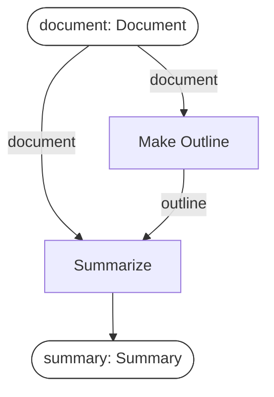
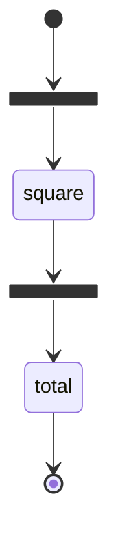
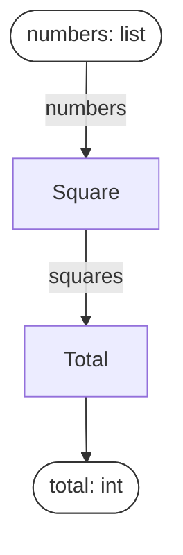

# workflow-plan

A typed, declarative representation of a workflow's logical plan, separate from the code that
executes it.

The Python package is `plan_types`.

**If you also use Pydantic Graph, both libraries export `Step`, and they mean different things.**
`pydantic_graph.Step` is an executable node — the decorated function is the implementation.
`plan_types.Step` is a declaration: `p-plan:Step`, an intended operation, as distinct from
`prov:Activity`, one execution of it. Import as `from plan_types import Step as PlanStep` when both
are in scope. (`Edge` collides too, but `plan_types`' is internal and not exported.)

LangGraph, Temporal and [Pydantic Graph](https://pydantic.dev/docs/ai/graph/builder/) execute
workflows. This library sits above them: it describes what a workflow *is* — steps, typed data
dependencies, and the constraints they must satisfy — and leaves execution to one of those, or to
plain Python.

## Installation

Not on PyPI. From source:

```bash
git clone https://github.com/borisdev/workflow-plan && cd workflow-plan
uv sync                          # add --extra pydantic-graph for the Pydantic Graph adapter
uv run pytest -q
```

## Concepts

| Type | Meaning | Layer |
|---|---|---|
| `Variable[T]` | a named, typed value that flows between steps | plan |
| `Step` | one operation: which Variables it consumes and produces | plan |
| `Plan` | a set of Steps; edges are derived from shared Variables | plan |
| `Service` | something a Step needs reachable (an API, a database, a file) | plan |
| `MultiStep` | a Plan that is also a Step, for nesting | plan |
| `Strategy` | a mapping from Step class to the function that implements it | binding |
| `StepRunner` | protocol for executing one Step; `LocalRunner` is the in-process implementation | execution |
| `run(plan, inputs, runner)` | executes a Plan in dependency order | execution |

`Plan`, `Step` and `Variable` are taken from [P-Plan](http://purl.org/net/p-plan#); `Activity`,
`Entity` and `Agent` from [PROV-O](https://www.w3.org/TR/prov-o/).

## Defining a plan

A Step declares its inputs and outputs. It contains no implementation.

```python
from plan_types import Plan, Step, Variable, render_mermaid, validate
from plan_types.invariants import topology, typing

document = Variable("document", Document)
outline  = Variable("outline", Outline)
summary  = Variable("summary", Summary)

class MakeOutline(Step):
    inputs, outputs = (document,), (outline,)

class Summarize(Step):
    inputs, outputs = (document, outline), (summary,)   # two inputs

plan = Plan(
    name="summarize_document",
    steps=(MakeOutline(), Summarize()),
    declared_inputs=(document,),
)

validate(plan, [*topology.ALL, *typing.ALL])   # -> []
print(plan.shape())                            # -> ((Document,), (Summary,))
print(render_mermaid(plan))
```



No part of this workflow is implemented. The plan is validated, typed and rendered without any
function bodies, prompts, models or runtime. Edges are computed from the Variables the Steps share,
so the diagram cannot disagree with the declaration.

Source: [`examples/hello/flow.py`](examples/hello/flow.py).

## Binding implementations

Implementations are ordinary functions, associated with Steps by a `Strategy` — a plain dict.
Parameter names must match the input Variable names, because the runner calls by keyword.

```python
from plan_types.execution import LocalRunner, check_strategy, run

def summarize_fast(document: Document, outline: Outline) -> Summary: ...
def summarize_precise(document: Document, outline: Outline) -> Summary: ...

fast    = {MakeOutline: outline_by_sentence, Summarize: summarize_fast}
precise = {MakeOutline: outline_by_sentence, Summarize: summarize_precise}

check_strategy(plan, fast)          # -> () ; reports unbound Steps and signature mismatches
run(plan, {"document": doc}, LocalRunner(fast))
run(plan, {"document": doc}, LocalRunner(precise))
```

The same `plan` object serves both. One Step may have several implementations without becoming
several Steps.

`render_mermaid(plan, strategy)` labels each node with its bound implementation.

## Execution

`LocalRunner` is sequential and in-process: no concurrency, no retries, no durability. An exception
propagates.

`to_pydantic_graph(plan, strategy)` compiles the same plan and strategy onto Pydantic Graph:

```python
from plan_types.execution.pydantic_graph import to_pydantic_graph

graph = to_pydantic_graph(plan, strategy)          # a pydantic_graph.Graph
result = await graph.run(state={}, inputs={"document": doc})
```

`tests/test_pydantic_graph.py` asserts both runtimes return the same result.

## Fan-out

A Step that runs per item declares the list it maps over. `map_over` names the source and collected
Variables; `inputs`/`outputs` describe one item.

```python
class Square(Step):
    inputs, outputs = (number,), (squared,)   # int -> int
    map_over = (numbers, squares)             # list[int] -> list[int]
```

Under `LocalRunner` this is a sequential loop. Compiled, it emits Pydantic Graph's `.map()` and
`join(reduce_list_append)`. The declaration is the same in both cases.

## Comparison with Pydantic Graph

Pydantic Graph provides steps, typed execution, edges, branching, map, join, reducers, state,
dependency injection, execution and diagram rendering. This library does not reimplement any of
them; it compiles onto them.

The difference is what a Step is. In Pydantic Graph the decorated function is both the graph node
and the implementation. Here a Step is a declaration, and implementations are bound separately, so
several are peers rather than one being primary.

[`examples/pydantic_graph_docs/`](examples/pydantic_graph_docs/) contains their documented examples
copied verbatim alongside equivalents, plus a control arm written with no plan layer. All of it runs
in the test suite.

```bash
uv sync --extra pydantic-graph
uv run python3 -m examples.pydantic_graph_docs.stage1_counter
uv run python3 -m examples.pydantic_graph_docs.stage3_map_join
uv run python3 -m examples.pydantic_graph_docs.control_no_plan
```

### Their `simple_counter.py`, round-tripped

Three values asserted equal: their hand-wired `GraphBuilder`, this plan on `LocalRunner`, and this
plan compiled onto their runtime. All `2`.

One difference is structural rather than stylistic. Their `increment` declares its input type as
`None` and reads and writes `ctx.state.value`. The dependency exists but does not appear in the
graph. Here the same value is an edge: `Increment --count--> DoubleIt`.

### Three implementations of one Step

One `Plan` object, three dict entries:

```
input             expected      exact   by_addition    cheap
[12]                   144        144           144      120   <- wrong
[3, 20]                409        409           409      209   <- wrong
```

Rendering the three arms produces identical topology with different implementation labels. A test
strips the labels and asserts the renders are byte-identical.

### Their `parallel_processing.py`

Same workflow, rendered by each library.

Pydantic Graph, via `graph.render()`:



This library, via `render_mermaid(plan)`:



Two differences:

- Their edges carry no type labels. An edge holds whatever the function returned and has no
  declared name. Here each edge is labelled with the Variable that flows along it.
- Their diagram includes execution constructs — `map` as a fork node, `reduce_list_append` as a join
  node. This diagram shows only the logical steps; the fan-out is a property of `Square`.

Both are correct for their purpose: one describes how the workflow executes, the other what it
computes.

### Control arm

[`control_no_plan.py`](examples/pydantic_graph_docs/control_no_plan.py) implements the same three
arms with `GraphBuilder` alone, in twelve lines, by parameterising the builder. It produces
identical results.

There is no line-count claim here. The measurable difference is that `build(square_impl)` requires
an implementation before it can produce a graph, a diagram or a type check, whereas a `Plan`
validates and renders with nothing implemented.

## Invariants

`validate(plan, invariants)` runs a list of `SemanticInvariant`s and returns a list of `Violation`s
rather than raising on the first.

| category | checks |
|---|---|
| `naming` | one name used for two concepts; two names used for one concept |
| `typing` | bindings whose types do not match; plan-time types carrying runtime state |
| `topology` | cycles, unbound inputs, orphaned Variables, two producers for one Variable |
| `provenance` | an `ONTOLOGY_IRI` naming a term that does not exist in the vendored ontology |

A check that cannot run reports `NOT CHECKED` rather than passing. `topology.bound_inputs` does this
when a Plan omits `declared_inputs`, because derived inputs make an accidental gap and a deliberate
signature the same set.

Acyclicity is an invariant, not a property of the type. A `Plan` may be cyclic; `topology.acyclic`
reports it if you run that check.

## Ontology grounding

`p-plan:Step` has a published definition, so a plan can be described to another tool or reader in
terms neither party owns. The ontologies are vendored with a hash and
`provenance.grounded_citation` verifies that every cited IRI names a real term.

There is **no RDF import or export** — no Turtle, no JSON-LD, no `rdflib`. The grounding is a
checked vocabulary, not a serialization format.

`p-plan:Step` is an intended operation; `prov:Activity` is one execution of it. The library keeps
them distinct even where a runtime maps them one to one. Temporal's `Activity` is `prov:Activity`,
not a `Step`.

`plan_types.ontology` holds the PROV-O side as Pydantic models — `Entity`, `Activity`, `Agent`, and
`Run` (`prov:Bundle`, one execution of a Plan, with validated referential integrity between its
edges). **None of it is populated by `run()`, which returns a plain dict.** Producing a provenance
document from an execution is a feature these types were written for and it is not built.

## Limitations

**Works today:** typed Plans, the four invariant categories, `render_mermaid`, `Strategy`,
`check_strategy`, `LocalRunner`, `map_over` fan-out, and `to_pydantic_graph`. 159 tests.

**Not built:** Temporal and LangGraph adapters, RDF import/export, persistence, retries, scheduling,
concurrency, an async `StepRunner`, embedding-based similarity, and agent-hook integration.

Specific constraints:

- **Cyclic plans do not execute.** A Plan may be cyclic and will render and validate, but a Plan
  carries no termination predicate, so no scheduler could run one. Pydantic Graph places that
  predicate in the node body (`-> Next | End[T]`), which is where it belongs. `MultiStep.until`
  declares an iterative region; collapsing a strongly connected component into one is not
  implemented.
- **`Fork` and `Join` are not first-class.** Only `map_over`.
- **`LocalRunner` is synchronous** and rejects an `async def` implementation rather than returning
  an un-awaited coroutine. A compiled graph awaits it normally.
- **At one implementation the plan layer is overhead.** With a single arm and two steps it costs a
  declaration and provides nothing. It becomes useful at the second arm or the second reader.
- **Everything demonstrable here is small.** The failure mode this addresses appears at scale: one
  downstream codebase has 18 variants of one extraction pipeline, 23 distinct step names, 47% of
  them used once, and `enrich`, `batch_enrich` and `enrich_one_finding` in a single file.

## Optional: pre-write hook

`conceptlint/integrations/pre_write.py` is a Claude Code `PreToolUse` hook that blocks a write which
introduces a Pydantic model duplicating an existing one:

```
⛔ `EvidenceLookup` looks like `EvidenceSearch`, which already exists at
   libs/.../find_evidence.py:86
```

```json
{"hooks": {"PreToolUse": [{"matcher": "Write|Edit",
  "hooks": [{"type": "command",
             "command": "<venv>/bin/python3",
             "args": ["-m", "conceptlint.integrations.pre_write"]}]}]}}
```

Use the `args` exec form. With a shell string, `2>/dev/null` discards the message and `|| true`
masks the exit code, either of which leaves a hook that runs and reports nothing.

Limits: it fires only on new Pydantic models, not on `Step` subclasses; it exits 2 on a violation
and 0 on any error, so it never blocks work for an unrelated reason.

`/lint-plan` ([`.claude/commands/lint-plan.md`](.claude/commands/lint-plan.md)) runs conceptlint
over a whole repository and reports by invariant id.

## Development

```bash
uv run pytest -q
uv run conceptlint .              # self-lint; CI fails if the count rises above the baseline
```

`conceptlint` is a second package in this repository. It is a supporting linter, not a separate
product.
